# 📡 Estudos em MikroTik - Certificação MTCNA

Este repositório contém todas as minhas anotações retiradas do curso **MTCNA V7** (20 horas) oferecido pela **SixCore Treinamentos**, ministrado pelo instrutor profissional **Leonardo Vieira**.

---

## 📘 Informações do Curso

- **Empresa:** [SixCore Treinamentos](https://www.linkedin.com/company/sixcoretreinamentos/posts/?feedView=all)
- **Instrutor:** [Leonardo Vieira](https://www.linkedin.com/in/albuquerqueleonardo/)
- **Carga horária:** 20 horas
- **Versão do curso:** MTCNA V7

---

## Laboratório

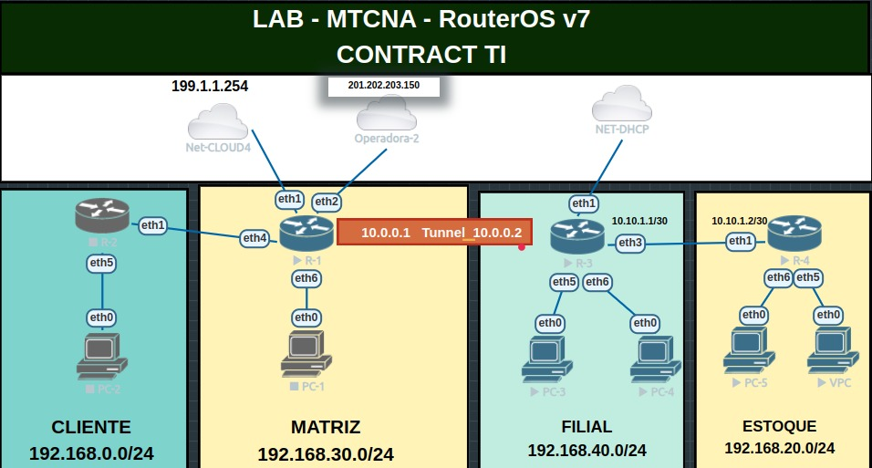

---


## 📌 Sumário

1. [📘 Informações do Curso](#informacoes-do-curso)
2. [⌨️ CLI MikroTik](#cli-mikrotik)
   - [Atalhos no CLI](#atalhos-no-cli)
   - [Gerenciamento de IPs](#listar-ips-das-interfaces)
   - [Configuração de DHCP](#adicionar-um-cliente-dhcp)
   - [Tabela de Rotas](#exibir-a-tabela-de-rotas)
   - [Configuração de NAT](#criar-nat-para-compartilhamento-de-conexao)
   - [Backup e Restore](#backup)
3. [🔗 Conectividade e Acessos](#connect-to-romon)
   - [Gerenciamento de Usuários](#criar-usuarios)
   - [Alteração de Portas de Serviços](#alterar-a-porta-de-servicos)
   - [Alteração da Identificação do Roteador](#alterar-identificacao-do-roteador)
4. [🌐 DHCP e Redes Locais](#dhcp-server)
   - [Configuração do DHCP Server](#dhcp-server)
   - [Funcionamento do DHCP Client](#dhcp-client)
5. [🖧 Bridge e Switching](#bridge)
   - [Criando uma Bridge](#bridge)
   - [Hardware Offload](#hardware-offload)
6. [📡 Roteamento](#roteamento)
   - [Check Gateway e Rotas](#check-gateway)
   - [Exemplo de Rotas Entre Filiais](#exemplo-pratico)
7. [🛡️ Firewall e Segurança](#firewall)
   - [Diferenças entre Stateless e Stateful](#stateless)
   - [Filter Rules - Regras de Bloqueio](#filter-rules)
   - [NAT - Tradução de Endereços](#natnetwork-address-translation)
   - [Mangle - Manipulação de Pacotes](#mangle)
   - [RAW - Proteção Avançada](#raw)
8. [🎯 QoS - Qualidade de Serviço](#qos)
    - [PCQ - Balanceamento de Banda](#pcq)
    - [Burst - Velocidade Temporária](#burst)
9. [🔄 Túneis e VPNs](#tunels)
    - [PPPoE Server](#servidor-pppoe)
    - [PPTP VPN](#pptp)
10. [🔧 Ferramentas Diversas](#ferramentas-diversas)
    - [Monitoramento e Alertas](#netwatch)
    - [Envio de Logs por E-mail](#tools-email)
    - [Comandos de Diagnóstico](#ping)
    - [Traceroute e Debug](#traceroute)
    - [Monitoramento de CPU e Tráfego](#profile)
    - [Torch - Análise de Pacotes](#torch)
    - [Gráficos de Tráfego](#graph)
    - [SNMP - Gerenciamento Remoto](#snmp)
    - [Exportação de Configurações](#suporte-rif)


# CLI MikroTik

## Atalhos no CLI

- **CTRL + L** → Limpa o terminal
- **F5** → Limpa a tela
- **CTRL + D** → Logout
- **CTRL + V** → Cola nas versões mais recentes
- **CTRL + K** → Limpa do cursor até o fim da linha
- **CTRL + C** → Interrompe um comando em execução

---

## Listar IPs das interfaces
Para visualizar os endereços IP configurados em cada interface:

```bash
ip address print
```

### Exemplo de Saída:
```bash
Flags: X - disabled, I - invalid, D - dynamic 
#   ADDRESS            NETWORK         INTERFACE                                                                                     
0 D  192.168.88.133/24  192.168.88.0    ether1                                                                                        
1    192.168.18.1/24    192.168.18.0    ether1   
```

---

## Adicionar IP a uma interface
Para adicionar um endereço IP a uma interface:

```bash
ip address add address=192.168.18.1/24 interface=ether1
```

---

## Remover um IP de uma interface
Substitua `N` pelo ID do IP listado no comando `ip address print`.

```bash
ip address remove numbers=N
```

---

## Desabilitar um IP de uma interface
Para desativar um endereço IP sem removê-lo:

```bash
ip address disable numbers=N
```

---

## Desfazer a última alteração
Caso tenha feito alguma configuração errada, use:

```bash
undo
```

---

## Adicionar um cliente DHCP
Para configurar a interface `ether1` para receber um IP dinâmico via DHCP:

```bash
ip dhcp-client add interface=ether1
```

Verifique se o cliente DHCP foi configurado corretamente:

```bash
ip dhcp-client print
```

### Exemplo de Saída:
```bash
Flags: X - disabled, I - invalid, D - dynamic 
#   INTERFACE   USE-PEER-DNS ADD-DEFAULT-ROUTE STATUS       ADDRESS
0   ether1      yes           yes               bound        192.168.1.100/24
```

---

## Exibir a tabela de rotas

```bash
ip route print
```

### Exemplo de Saída:
```bash
Flags: X - disabled, A - active, D - dynamic, C - connect, S - static, r - rip, b - bgp, o - ospf 
#      DST-ADDRESS        GATEWAY        DISTANCE
0 ADC  192.168.18.0/24    ether1         0
1 A S  0.0.0.0/0          192.168.18.1   1
```

---

## Criar NAT para compartilhamento de conexão
Este comando mascara todo o tráfego da rede local para sair pela interface WAN.

```bash
ip firewall nat add chain=srcnat action=masquerade out-interface=WAN
```

---

## Corrigir o NTP (Sincronização de Hora)
Manter o NTP (Network Time Protocol) atualizado evita problemas com logs e autenticação de dispositivos.

```bash
/system ntp client set enabled=yes primary-ntp=a.ntp.br secondary-ntp=b.ntp.br
```

---

## Configurar um link dedicado

### Criar um pool de IP
Adicione um endereço IP público na interface que receberá o link dedicado:

```bash
ip address add address=201.202.230.254/24 interface=ether2
```

### Configurar rota padrão
Defina o gateway padrão para acesso à internet:

```bash
ip route add dst-address=0.0.0.0/0 gateway=201.202.230.254
```

### Definir o DNS
Configure um servidor DNS público:

```bash
ip dns set servers=8.8.8.8
```

---

Este guia fornece comandos básicos para configuração e gerenciamento de redes no MikroTik via CLI.


# connect to romon
Este comando ativa o romon com sua respectiva senha
```bash
tool/romon/set enabled=yes secrets=88191198
```

## Criar usuários

Para criar um usuário no microtik fica em 

```bash
/user add name=usuário password=senha group=full

```

## Alterar a porta de serviços

Listar portas de serviços

```bash
ip service print
```
```bash
[admin@MikroTik  Provedor] > ip service print 
Flags: X, I - INVALID
Columns: NAME, PORT, CERTIFICATE, VRF
#   NAME     PORT  CERTIFICATE  VRF 
0 X telnet     23               main
1 X ftp        21                   
2   www        80               main
3   ssh        22               main
4 X www-ssl   443  none         main
5 X api      8728               main
6   winbox   8597               main
7 X api-ssl  8729  none         main
[admin@MikroTik  Provedor] > 
```

Para alterar a porta do serviço
```bash
/ip service set winbox port=<nova_porta>

```

Para desabilitar a porta de um serviço

```bash
 ip service disable <nome da porta>
```

## Alterar Identificação do roteador
Mudar o nome do roteador microtik

```bash
/system/indentfy set name=<Nome do roteador>
```


## Backup
Dentro do microtik deve se sempre subir o backup no mesmo tipo de equipamento

### Tipos de backup

- .bkp: Clona MAC das interfaces, usuários e senhas de ROS
- RSC: Compatível com Hardware diferentes, pode fazer backup e restore por partes do conteudo.

Comando para gerar um bkp
```bash
system/backup save  name=<Nome do Backup>
```


Gerando um backup somente do firewall 
```bash
ip firewall/export file=teste123 
```

Adicionando o comando terse, quando se abre o backup você consegue ver linha por linha a configuração do equipamento.

```bash
ip firewall/export file=teste123 terse
```

Exemplo de backup terse

```bash
# feb/04/2025 01:09:07 by RouterOS 7.2.3
# software id = 
#
/interface wireless security-profiles
set [ find default=yes ] supplicant-identity=MikroTik
/port
set 0 name=serial0
/user group
add name=SuporteN1 policy="local,read,winbox,password,!telnet,!ssh,!ftp,!reboo\
    t,!write,!policy,!test,!web,!sniff,!sensitive,!api,!romon,!dude,!rest-api"
/ip address
add address=199.1.1.1/24 interface=ether2 network=199.1.1.0
/ip dhcp-client
add interface=ether1
/ip dns
set servers=8.8.8.8
/ip firewall nat
add action=masquerade chain=srcnat out-interface=ether1
/ip route
add gateway=192.168.88.1
/ip service
set telnet disabled=yes
set ftp disabled=yes
set api disabled=yes
set winbox port=8597
set api-ssl disabled=yes
/system identity
set name="MikroTik  Provedor"
/tool romon
set enabled=yes

```

Como executar o export
```bash
export file=tudo
```


# Botão de Reset
Botão de reset tem 4 funções adicionadas da seguinte forma

- Desligar a fonte da RB
- Ligar a RB com o reset pressionado
- Solte o botão reset no tempo X
    - 3 Seg ativa o backup da RouterBOOT
    - 5 seg resert do equipamento
    - 10 seg ativa o modo CAPS(A parte de WI-FI irá ser administrada por outro equipamento na rede )
    - 15 seg ou mais reinstalação via Netinstall


# DHCP Server

Para se criar um DHCP server no Microtik podemos fazer via CLI ou através do winbox.

CLI:

1. Criar uma pool de IP
```bash
/ip pool add name=dhcp_pool ranges=192.168.1.100-192.168.1.200
```
2. Criar DHCP server
``` bash
/ip dhcp-server add name=dhcp_srv interface=ether2 address-pool=dhcp_pool disabled=no
```

4. Configurar a rede a ser entregue do DHCP
```bash
/ip dhcp-server network add address=192.168.1.0/24 gateway=192.168.1.1 dns-server=8.8.8.8,8.8.4.4

```

Feito a criação do nosso DHCP server vamos precisar somente verificar os dispositivos dentro do nosso DHCP conectadas
```bash
/ip dhcp-server lease print
```

Ou podemos fazer pela versão simples do Winbox na Aba de DHCP server seguindo as etapas do DHCP Setup.


# DHCP Client
Quando o algum dispositivo chega e começa a procurar por IPs ele faz o processo que chamaos de DORA
DORA.

- D = Discover - Dispositivo fazendo descoberta de rede no loca 
- O = Offer - Oferta do servidor DHCP para o cliente
- R = Request - Solicitação de aceitação do servidor DHCP
- A = Ack - COnfirmação do DHCP que foi entregue o Ip


Quando ele faz a descoberta de rede, o dispositivo ele procura servidores DHCP na rede multicast e o servidor DHCP sempre responde na unicast.

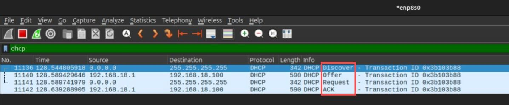

Comando CLI para criar dhcp client:
```bash
/ip dhcp-client add interface=<nome_da_interface> disabled=no
```


# Bridge

- Bridge é um dispositivo de camada 2 osi
- São interfaces transparentes
- Um switch de rede é uma bridge com multiplas portas
- Ao criar uma Bridge ela usa o mac address da porta selecionada


## Hardware offload

Quando se cria uma bridge ele ja traz a teclonogia de hardware offload para poder trafegar dados somente nas portas do switch, agora quando se tem uma interface normal
o trafego de dados se passa dentro dentro do switch chip que gerencia as portas até a CPU para decisões de roteamento.

Para se criar um bridge

```bash
/interface bridge add name=bridge1
```

Para associar as interfaces a bridge
```bash
interface/bridge/port/add bridge=bridge-Lan interface=ehter
```


# Roteamento

Aqui está todas as flags de roteamento

    -   D - dynamic
    -   X - disabled
    -   I - inactive
    -   A - active
    -   c - connect
    -   s - static
    -   r - rip
    -   b - bgp
    -   o - ospf
    -   d - dhcp
    -   v - vpn
    -   m - modem
    -   y - copy
    -   H - hw-offloaded 
    -   ecmp - Equal-Cost Multi-Path

`ip > routes`
Conceito de roteamento do winbox é muito simples, temos que responder duas perguntas basicas ao criar uma rota.
- `dst.address`: Aonde quer ir ? 
- `Gateway`: De onde quer sair para chegar ao destino

Desta maneira conseguimos criar rotas dentro do microtick como por exemplo, tudo que foi com destino a 0.0.0.0/0(Internet) saia por tal interface.

## Check gateway
A cada 10 segundos envia um ICMP echo request(ping) ou uma Solicitação arp request
Se varias rotas usam o mesmo gateway e existe uma rota que tem opção Check gateay habilitada, então todas as rotas estão sujeitas ao comportamento do gateway, se ele estiver down as rotas não são direcioondas.

o campo distace dentro do ip route é quem define por onde vai passar o trafego.


Entregar o 201.202.230.254 na operadora 2 do tipo cloud3

### Exemplo pratico

Digamos que queremos que o computador da filial consiga reconhecer a os computadores do estoque e vice versa.

Podemos criar uma rota que tudo quando for para 192.168.20.0/24 ele irá sair pelo gateway do estoque 10.10.1.2/30 e o contrario tambem a ser feito, tudo que for com destino a 192.168.40.0/24 irá sair pelo gateway 10.10.1.1/30.

Sendo assim acessamos o roteador microtik da fila e fazemos o seguite comando.

```bash
ip/route/add dst-address=192.168.20.0./24 gateway=10.10.1.2
```

Depois acessarmos o roteador do estoque do estoque e fazer o mesmo para o outro lado.

```bash
ip/route/add dst-address=192.168.40.0./24 gateway=10.10.1.1
```
Sendo assim nossos computadores das duas redes locais consguem se conectar, um unico ponto de lembrança é que para os computadores do estoque sairem para rede, não se deve ter nenhuma config de nateamento, criando somente uma rota default apontando que caso irão sair para rede vão sair pelo gateway da filia.

```bash
ip/route add gateway=10.10.1.1/30
```
Quando não apontamos o dst-address via cli ele automaticamente detecta que faz parte de uma rota default e que o destino é 0.0.0.0/0 que será a internet.


# Wireless

microtik router os prevê suporte completo aos padrões de rede wireless IEEE
    - 802.11a/n/ac(5Ghz)
    - 802.11b/g/n(2.4Ghz
    - 802.11ad/(60Ghz) Wireless WIre

## NV2

    - É um protocolo Wireles propietario da microtik
    - Beneficios
        - Maior Velocidade
        - Baixa Latência
    - TDMA - TIma DIvision MUltiple Access
    - O NV2 não aceita Birtual AP e o limite é de 511

| **Padrão IEEE** | **Frequência** | **Velocidade**        |
|----------------|--------------|----------------------|
| 802.11a       | 5GHz         | 54Mbps              |
| 802.11b       | 2.4GHz       | 11Mbps              |
| 802.11g       | 2.4GHz       | 54Mbps              |
| 802.11n       | 2.4 e 5GHz   | Até 450 Mbps*       |
| 802.11ac      | 5GHz         | Até 1300 Mbps*      |
| 802.11ad      | 60GHz        | 2 Gbps              |

*Depende do modelo RB


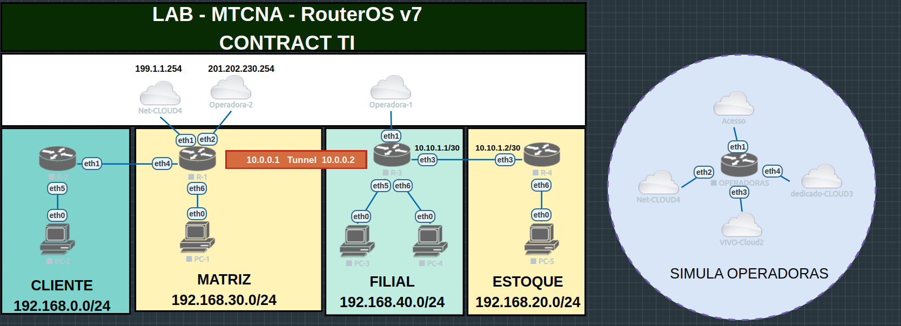

Atualmente pode se Utilizar 3 Aps microtik na mesma rede sem sofrer interferencia de sinal

Para ativar de certa maneira o "mesh" colocar os aps com mesmo ssid e senha que ja irá fazer o roming normalmente.

Pontos importantes:
- Quanto maior a largura do canal
    - Menor numero de numero de canais
    - Mais vulneravel a interferências
    - Diminuiu a a potencia do sinal a logas distancias
    

## Modes Wifi
| Modo            | Se conecta a um AP | Atua como AP | Passa múltiplos MACs? | Uso comum                     |
|---------------|----------------|-----------|----------------|-----------------------------|
| **Station Bridge** | ✅ Sim | ❌ Não | ✅ Sim | Cliente Wi-Fi transparente |
| **AP Bridge** | ❌ Não | ✅ Sim | ✅ Sim | Roteador principal Wi-Fi |
| **Bridge** | ✅ Sim (somente 1 AP) | ❌ Não | ❌ Não | Links PTP |
| **Station** | ✅ Sim | ❌ Não | ❌ Não | Cliente Wi-Fi com NAT |

# firewall

## Stateless

firewall stateles normalmente tende a somente verificar o cabeçalho da requisição e deixar passar, ele não grava em si se aquele pacote ou conexão 
ja pertence ou esta ativa. Apenas se é analisado o cabeçalho do pacote e ip de destino e se aplica a configurações predefinidas do administrador da rede.

`Vantagens`
- Mais rapido pois não precisa manter tabelas de conexão
- Menos consumo de memoria e CPU
- Util para cenarios de alto desempenho como load balances.

`Desvantagens`
- Menos seguro, pois não consegue detectar ataques que exploram conexões estabelecidas
- Pode permitir trafego não autorizado por não reconhecer conexões estabelecidas.

## Statefull

Em contrapartida o statefull  mantem o rastreamento das conexões ativas da rede. Isso significa que ele analisa não apenas pacotes individualmente, mas tambem
a relação dos pacotes com as conexões ja estabelecidas. Ele verifica se o pacote faz parte de uma conexão existente ou se esta tentando estabelecer uma nova conexão
assim ele consegue permitr ou bloquear pacotes com base no estado da conexão.

Vantagens
-  Maior segurança, pois verifca se o trafego são de conexões legitimas
-  Redução de trafego desencesário, ja que não precisa reavaliar pacotes conhecidos
-  Permite criar regras mais sofisticadas, como permitir apenas conexões iniciadas de dentro da rede.

Desvantagens
-  Consome mais recurso (Memoria e processamento) por armazenar estados das conexões


## Filter rules

Filter rules é onde criamos nossa regras de firewall para permitir ou bloquear trafego em nossa rede com base em diversos criterios como IP, Porta, protocolo e lan
Exemplos: 
- `Bloquear sites`: Criar regra para impedir acesso a domínios específicos
- `Liberar ou bloquear Portas`: Definir quais portas podem ser acessadas de dentro da rede.
- `Proteção LAN`: Bloquear acessos indesejados na rede local 
- `Segurança do seu router`: Impedir ataques como Brute Force, DDoS e proteger serviços administrativos como SSH e winbox

Exemplo de comando:
```bash
/ip firewall filter add chain=forward action=drop dst-port=22 protocol=tcp
```
Aqui estamos bloqueando o trafego na porta SSH(22)

## NAT(Network address translation)

O Nat é onde podemos modificar os endereços e portas dos pacotes que entram e saem da rede.

###  Tipos prncipais de NAT
- `Masquerade`: Usado mascarar um IP local para um IP publico
- `Dst-NAT(Destination NAT)`: Redireciona pacotes para um IP e porta específicos
    - Exemplo:
     Direcionar trafego da porta 80 para um servidor WEB
    
- `Src-NAT(Source NAT)`: Altera o ip de origem dos  pacotes

Exemplo de comando Utilizando src-nat e Masquerade:
```bash
/ip firewall nat add chain=srcnat action=masquerade out-interface=ether1
```
Tudo que vier da minha rede local, saem pela interface ether 1 para que todos compartilhem o mesmo IP publico


## Mangle
O Mangle permite manipular pacotes para controle de trafego avançado, marcação de conexões e implementação de balanceamento de carga.
Pricipais usos:
-   `Load Balances`: Distribuir tráfego entre multiplos links de internet.
-   `Marcaçoes de pacotes e conexões`: Para aplicar regras especificas baseado no trafego
-   `Alterações de pacotes TTL(Time to live)`: Impedir que provedores detectem roteamento de internet compartilhado

Exemplo de marcação de pacote para load balance:

```bash
/ip firewall mangle add chain=prerouting action=mark-connection new-connection-mark=WAN1_conn passthrough=yes in-interface=WAN1
```
Aqui, estamos marcando conexões que entram pela interface WAN1


## Raw
firewall que age diretamente na interface WAN do microtik antes mesmo de passar pelas regras de Filter, NAT e mangle, ele pode descartar pacotes antes que sejam 
analisados pelo restante do firewall.

Principais usos: 
-   Descartar pacotes antes que chegue no firewall do microtik, evitando aumento do processamento do equipamento
-   Proteção contra ataques DDoS e scans de rede, podendo descartar pacotes maliciosos como SYN fload, Port Scanners e outros ataques comums.
    
Exemplos de comandos: 

1. Bloqueio de pacotes de ataques DDoS
```bash
/ip firewall raw add chain=prerouting protocol=tcp tcp-flags=syn action=drop
```
2. Bloqueia uma lista de ips suspeitos realizando scans de porta
```bash
/ip firewall raw add chain=prerouting src-address-list action=drop
```


### Tipos de chain


Dentro do conceito de firewall temos três tipos padrões  de fluxos de pacotes.
- `Input`: Destinado ao router
- `Foward`: Passando pelo router
- `Output`: A partir do router


E dentro do router O.S ele começa a ler as regras de acordo com as chains, então primeiro input, foward ...
#### Input


Tudo que se chega ao seu router, seja da internet ou rede local se considera como LAN

#### Foward

Todo trafego que passe pelo nosso microtik.
Exemplo, computador da minha rede local quer se comunicar com a impressora, o dst-addres que o computador manda a requisição é diretamente o IP da minha impressora, porem obrigatoriamente ele tende a passar pelo gateway, isso seria um trafego do tipo foward.


#### Output
Seria todo trafego inicializado a partir de meu router.

## Tipos de conexão

- `New`: Pacote Utilizado para abrir uma conexão

- `Established`: Estabilizado a conexão

- `invalid`: Todo pacote que não esta abrindo uma conexão, e ele não esta em nenhuma conexão estabelecida.

- `Related`: Quando temos uma conexão estabelecida e vamos trocar dados, ele inicializa um novo tipo de conexão 

## Todas as Actions 

- Add dst to address list
    - Adiciona todos os ips de destino passando pelo meu roteador e adicina em uma lista

- add src to addres list
    - Adiciona todos os ips de origem passando pelo meu roteador e adicina em uma lista

- drop
    - Ele dropa todos os pacotes

- Reject
    - Como se fosse um drop, porem ele retorna uma mensagem para o pacote dizendo o por que do Reject

- accept
    - Aceita

- Jump 
    - Ele faz um desvio do firewall passando por outras validações especificas de acordo com o cenario.

- Log
    - Gera log de acordo com a regra, Exemplo gere um log sempre que acessarem o facebook

- Return
    - Ele retorna para o fluuxo convencional quando dentro de um Jump

- Tarpit
    - Ele aceita  a conexão SYN porem logo após descarta o pacote, seria como se fosse para enganar.


## NAT (Network addres translation) 
Tradutor de endereço de rede, normalmente sempre se Utiliza para entregar um ip publico para todos na rede local.
ELe basicamente faz a tradução do endereço ip local para o publico. Utilizamos ele com tudo que for src 0.0.0.0./0 masquerade.<br>

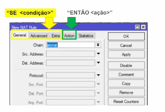


### Tipos de chain dentro de NAT
- srcnat
    - origem da requisição

- dstnat
    - Destino do request

    
### NAT Masquerade

Ele faz a tradução do endereço IP local para o IP publico<br>
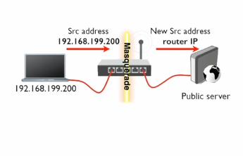


Em casos de duas operadoras no Link, se recomenda fazer o NAT para dois links de internet com srcNAT.<br>
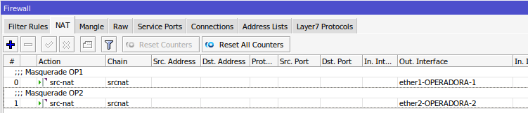
Utilizando a chain src-nat sempre quando for com destino a uma das duas interfaces wan, faça uma masquerade passando o IP estatico da operadora, Se for ip estático,se não usar somente masquerade caso for dinamico.

### DST Nat

Podemos fazer por exemplo, tudo que for com destino a 8.8.8.8 no protolo tcp na porta 2000 nossa action dst-nat irá reescrever o ip de destino para 200.201.202.203 (Microtik) na porta 8291. Ou seja, sempre quando eu ir para 8.8.8.8 na porta 2000 eu na verdade estarei acessando o meu segundo microtik.
Da mesma maneira podemos fazer o contrário, ou seja tudo que vier em mihas interfaces WAN com protocolo TCP na porta 3389 dst nat para endereço do meu servidor.


# QoS

Qos é a performance de uma rede com relação ao Usuário, podemos definir priorização de trafeou ou sua limitação.
Conseguimos fazer controle de banda de acordo com os horarios, aplicando isso para um bloco de IP ou interface.


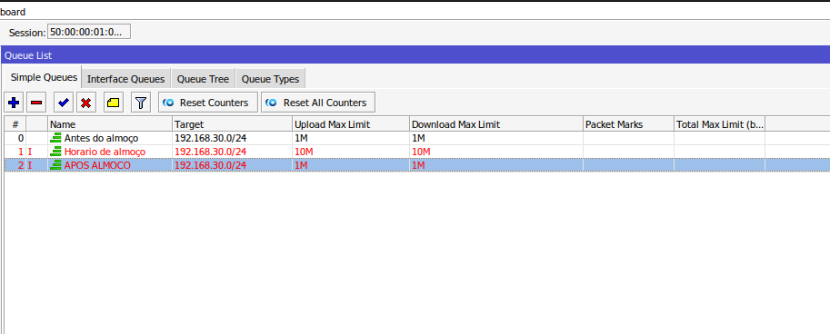

Para definirmos a regra, precisamos passar um target que seria nosso alvo, podemos passar um bloco de IP ou um ip especifico ou se não até mesmo uma interface.
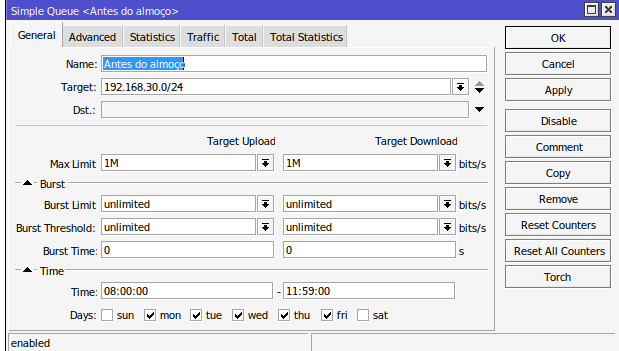)

Definindo:
- Target
- Horario
- E banda para passsar

Indo para aba advanced, temos mais algumas opções da qos

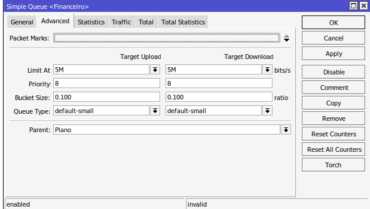

Campos
-   Limit At
    - É onde definimos a banda maxima que pode ser alocada
- Priority
    - Ordem de prioridade na QoS exemplo 8 é a menor prioridade
-   Parent, seria a quem essa qos estaria alocalda, como se fosse programação orientada objetos, onde uma QoS se abstrai de outra
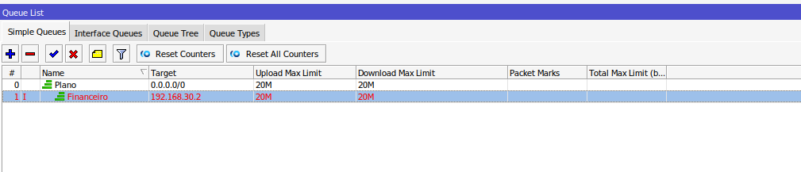


## PCQ

Tipo de enfileiramento de filas, substitui multiplas qos para uma só.

Exemplo:<br>
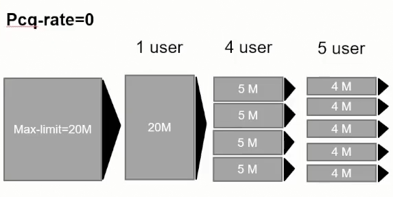

Meu Max-LImit=20m indica que o maximo que tenho de banda é 20m ou seja o PCQ irá pegar esses 20m e distribuilos conforme a quantidade de Usuários.


Agora neste outro cenário temos um PCQ rate setado em 5 oque isso significa ? 
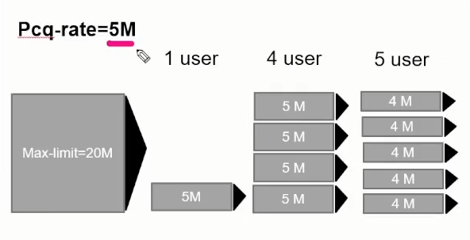

Neste ponto temos novamente o max-limit em 20M porem com um PCQ rate de 5M e isso basicamente nos indica que nossaa banda contratada é 20M e que o PCQ rate indica é que basicamente por mais que tenha somente um Usuário na empresa logado e precisando de internet o maximo que ele vai consumir sera os 5 megas do PCQ rate.

Vamos as configurações dentro do winbox


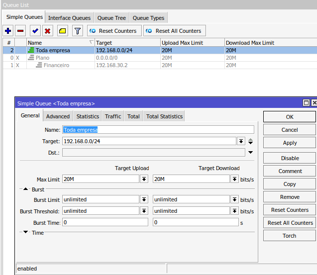

Definimos:
- Target
- Max Limit

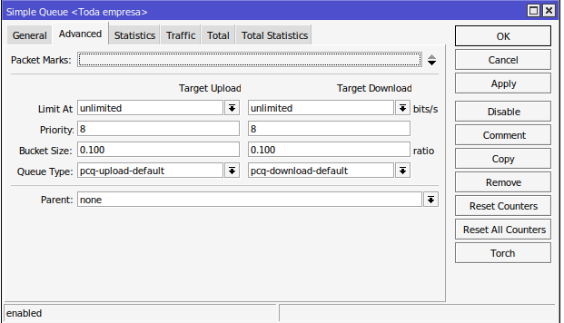 
Definimos a queue tupe como pcq-upload-default assim temos o primeiro exemplo com o PCQ rate zerado distribuindo a banca com base no numero de Usuários.
Para definirmos o Rate do PCQ vamos em > Queues > Queues Types > pcq dowload ou upload

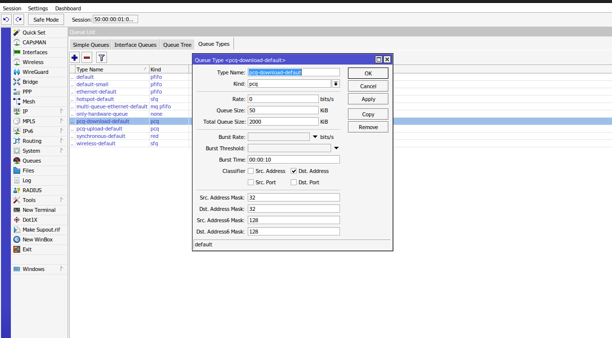

Aqui conseguimos definir o rate.

## Burst
Usado para permitir velocidade mais alta por um curto periodo de tempo, muito utilizado em provcedores para entregar para o cliente a sensação de estar recebendo mais que o contratado.

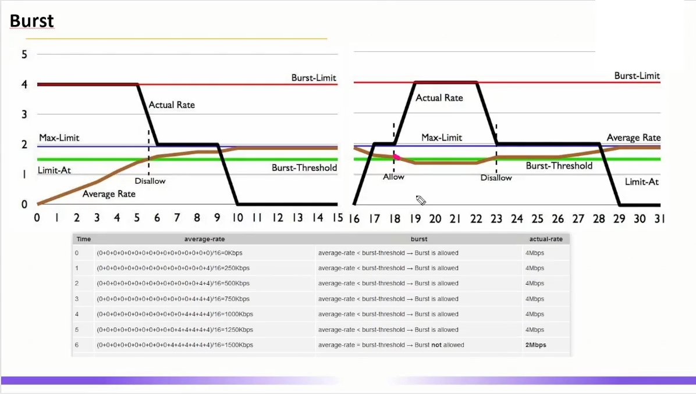

Para interpretarmos a imagem, temos que entender algumas destas linhas.
- Burst Limit (Linha Vermelha)
    - Limite de banda que o cliente pode alcançar com burst ativado

- Max Limit (Linha azul)
    - Banda real contratada pelo cliente

- Limit At (Linha sinza)
    - Banda minima garantida ao cliente

- Average rate(Linha Marrom)
    - Consumo médio do cliente

- Burst Threshold (Linha verde)
    - Define o limite que burst pode ficar ativo


Vamos citar um exemplo de um cliente.

- Cliente tem contratado 2MB
    - Max Limit = 2MB

- O Maximo que ele pode bater é 4MB com burst
    - Burst = 4MB

- O Maximo que ele pode utilizar o bonus é por 6 segundos
    - Burst threshould = 6s

    
Neste senário, quando o cliente começar a navegar na internet, no inicio terá um carregamento mais rapido da página pois estará utilizando o Burst quando o consumo médio do cliente (Average rate) encostar no Burst Threshold o burst será desligado e o consumo do cliente voltara para o Max limit. O Burst fica sendo ativado e desativado a qualquer momento, então para navegações WEB attravés do protocolo HTTP ele da para o cliente uma sensação de fluidez melhor, pois sempre ao carregar a pagina ele bate no burst e ao navegar na pagina o burst se desliga, tornando o primeiro carregamento da pagina muito bom. Isso para provedores é muito utilizado para fazer testes de velocidade, o burst é ativado ao realizar o teste batendo um pouco a mais acima do contratado, dando ao cliente uma sensação de estar recebendo mais do que paga pelo produto fazendo assim uma entrega de valor muito efetiva ao cliente final.


Dentro do Router OS para sua configuração, podemos definiar.

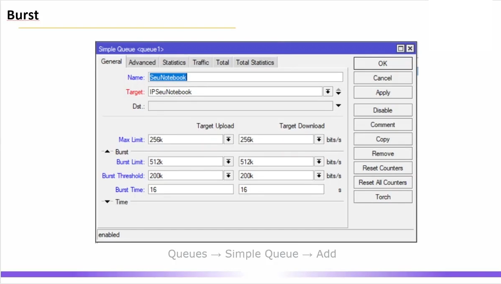

Definimos nosso:
- Target (Alvo)
- Max Limit
- Burst Limit
- Burst Threshold
- Bust Time

Depois é soment ir na area de trafic e validar o aumento do traćfico batendo com o burst

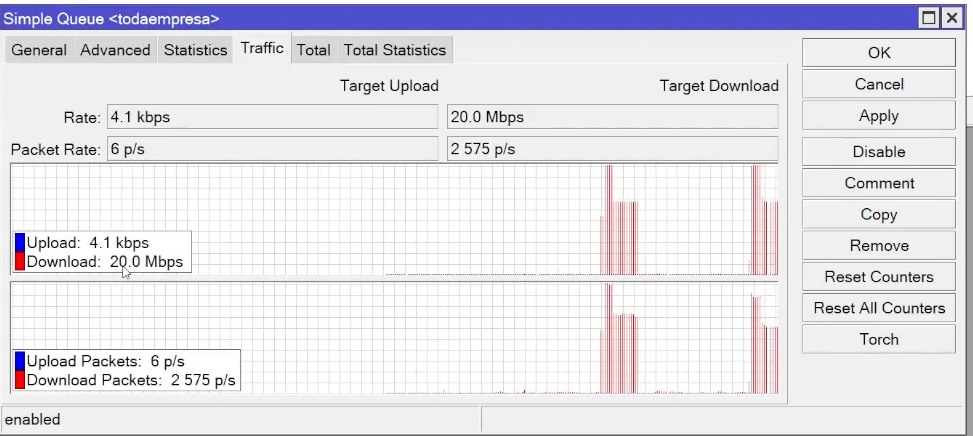

# Tunels

## Servidor PPPOE

Primeiro passo para cria um servidor PPPOE

1. Criar uma Pool de ip
`Ip > pool > Criar`
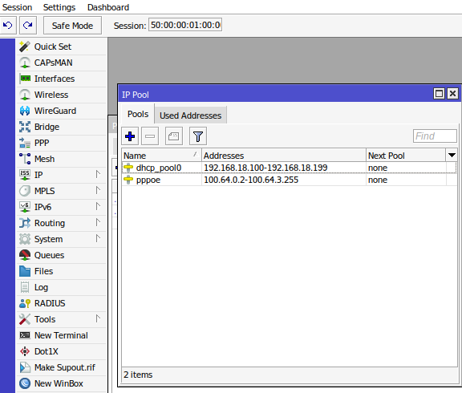

2. Criar Profile para servidor PPPOE


Deve seguir as configurações:
- Profile
    - Name
        - Nome do profile
    - Local Address
        - Utiliza comunicação /32 colocar um ip fora da pool de ip
    - Remote address
        - Ip que o cliente pode utilizar do seu lado: Passar a pool de ip criado
    - DNS Server
        - DNS que será entregue no ato da conexão
    - Protocols
        - Use IPV6
            - Deixará ativo caso for ativado IPV6 futuramente
        - Use MPLS
            - Default
        - Use Compression
            - Compressa os dados passando pela conexão, não necessario no momento
        - Use Encryption
            - Irá criptogradar a conexão do cliente com IPV6 depende de caso a caso, encryptografando aumenta segurança mais tambem aumenta consumo de cpu
        
Beleza, criamos o profile para nosso servidor pppoe, precisamos criar o profile do lado do cliente de acordo com cada plano de velocidade.
Para isso vamos criar os proximos profile

3. Criar profile dos planos:<br>
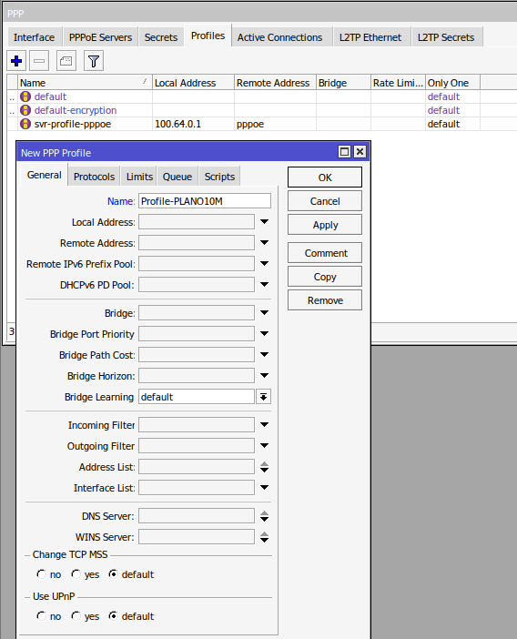 
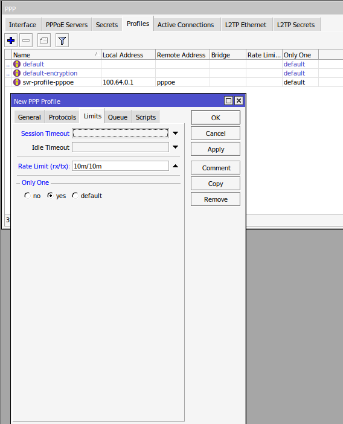

- Name: Profile-10Megas
- Limits
    - Session Timeout: Tempo em que o cliente ficara conectado com mesmo IP
    - Idle Timeout: Se ficar ocioso por duas horas ou mais sem utilizar o tunel, desconecta o cliente.
    - Rate Limit(RX/TX): Limita a banda do cliente 10m dowload / 10m upload
    - Only One: Caso cliente conectado com aquele Usuário e senha, não será possivel mais fazer login com aquele usuário no servidor.

4. Criar o Secrets, usuário e senhas PPPOE
Normalmente é padrão ver servidores radius que contenha usuários e senha dos PPPOE dentro do sistema e depois somente fazer a conexão do concentrador com radius.
Porem entretanto toda via, não é necessario para criação de um PPPOE server, na aba de secrets podemos criar usuário e senhas pppoe.

Para criar a senha basta ir em PPP > Secrets

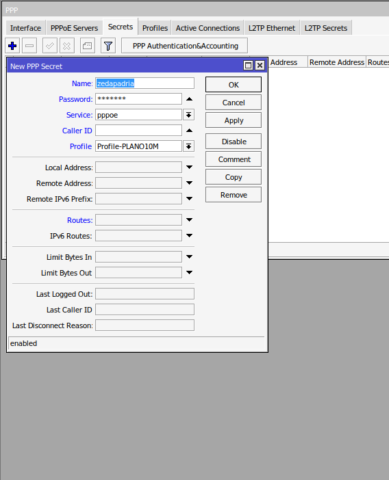

- Name: nome do usuário
- Password: Senha
- Service: Indica que esse usuário e senha será utilizado somente para o serviço de pppoe
- Caler ID: Faz o controle pelo MAC do roteador
- Profile: Passamos o plano do cliente

5. Criar o PPPOE server
Aba > PPP > PPPoE Server > 
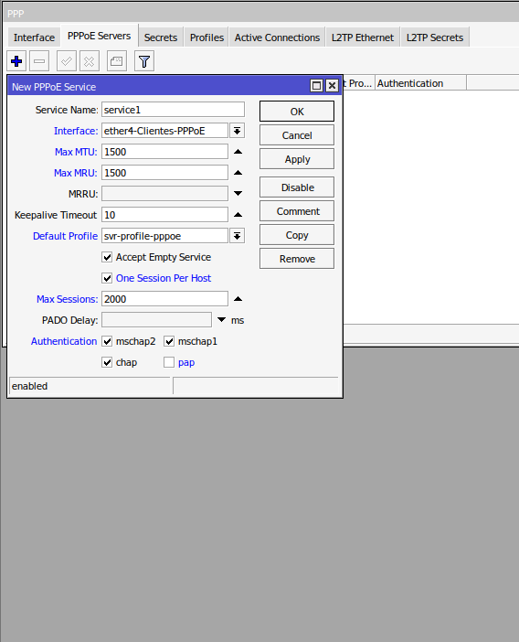

- Service: Nome do servidor PPPoE
- Interface: Em qual interface irá entregar o PPPOE
- Max MTU: Define o tamanho do pacote de transmissão (Deve ser analisado de acordo com sua infraestrutura)
- Max MRU: Define o tamando do pacorte de recepção (Deve ser analisado de acordo com sua infraestrutura)
- Default Profile: Passamos o profile criado para nosso servidor
- Keepalive: De quanto em quanto tempo o servidor irá derrubar a conexão do cliente em caso de não utilização
- Max sessions: Estou definindo que o maximo de conexão no meu servidor  PPPoE é 2000
- Autentication: Protocolos de comunicação durante o tunel, é bom desmarcar o pap pelo fato de não ser criptografado.


6. Configurar um PPPOE cliente em outro lugar para testar conexão
Relembrando nosso cenario.

Nosso PPPOE server está configurado em nossa matriz, vamos configurar o cliente no roteador R2 a sua esquerda.
para criar PPPOE client ir em PPP > interface > adicionar PPPoE client

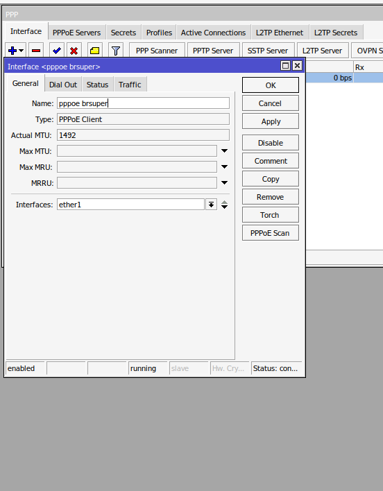

- Name: Nome da interface
- Interface: Interface a qual vai receber conexão
### Dial Out:<br>
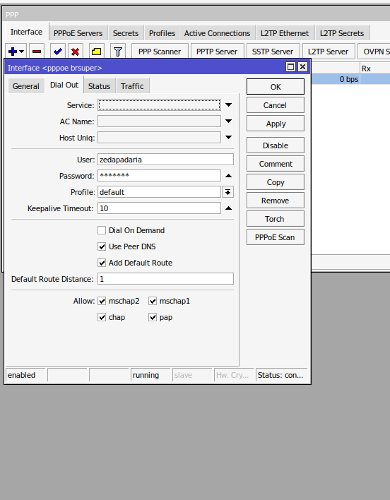
- User: usuário PPPoE
- Password: senha PPPoE
- Profile: default
- Use pear DNS: Recebera endereço DNS do servidor PPPoE

Logo após somente aplicar e verificar se ficou com a Tag de Running
Pronto, criados nosso PPPoE server e Client, para validar mos se esta tudo ok podemos retornar no nosso PPPoE server e verificar as conexões ativas.
PPP - > Acrtive Connections

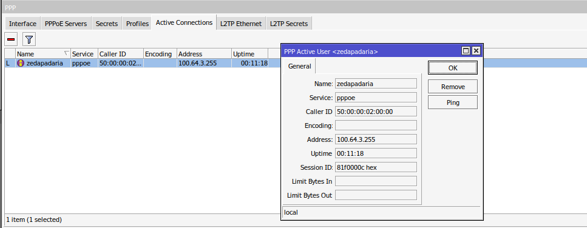


Se você for em Queues você tambem verá a qos dinamica criada através do profile de controle de banda.

# PPTP
Não muito recomendado para conexões PPTP devido sua insegurança do protocolo, ele utiliza como protocolo
- Protocolo: TCP
- Protocolo de codigo: 47 GRE
- Porta 1723


Para usar como exemplo de conexão PPTP vão fazer a conexão com nossos dois roteadores do laboratorio MK1 da Matriz e MK3 do comercial.
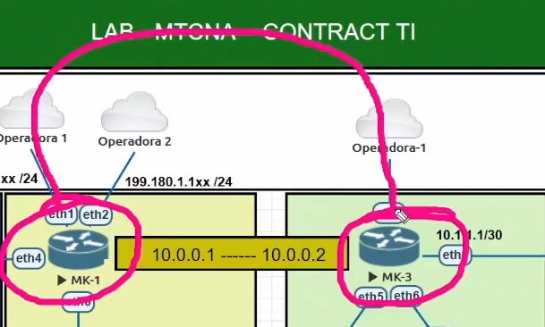

Para ativalo vamos em PPP > interfaces > PPTP Server


Logo após precisamos criar um Secret para conexão estabelecer.


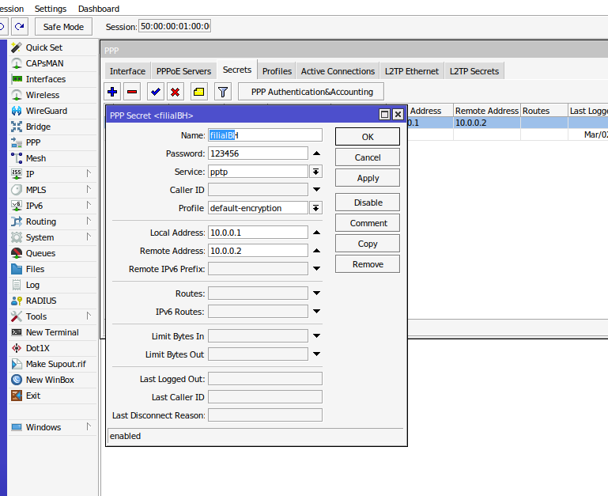

Vamos definir:
- Name: Nome
- Password: senha
- service: pptp
- Profile: podemos utilizar padrão
- Local address: será o meu ponto de conexão do lado do servidor
- Remote addrss: sera o ip de conexão da outra ponta dentro do tunel

Logo após somente irmos no outro microtik e configurarmos o nosso PPTP client.
Indo em PPP > interfaces > PPTP client
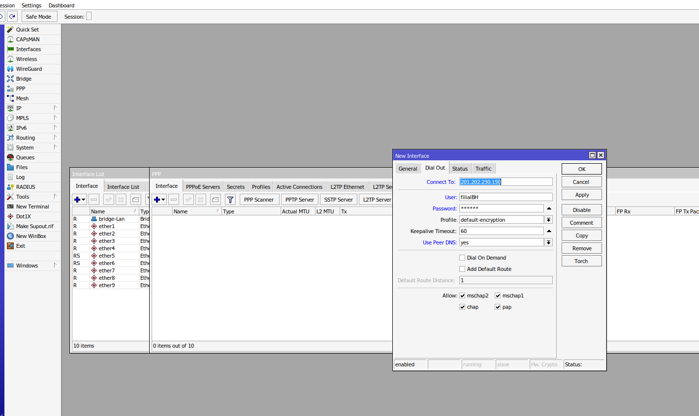

Vamos precisar definir:
- Connect To:  ip de destino da conexão
- User: usuário
- Password: senha
- User pear DNS: Irá utilizar DNS da conexão

Pronto nossa conexão está estabelecida, basta configurar nossas tabelas de rotas para tudo que for a destino de uma rede local seja da matriz ou filial, sair por seu gateway correspondente. 


# Ferramentas Diversas

## Tools Email
É possivel colocar o microtik para se conectar com um servidor de E-mail para envio de logs e alertas, basta ir em Tools > Email <br>
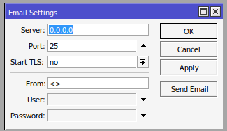
Após preencher os campos, basta configurar os alertas para mandar E-mail como por exemplo fail over em casos de queda de um link, ou por exemplo o envio de um backup.


## Netwatch 
Essa ferramenta conseguimos fazer um monitoramento de algum serviço, pode ser um relogio de ponto, servidor, dns, etc.
Ele irá ficar pingando o dispositivo frequentemente de acordo com o tempo desejado.<br>


Porem o Netwatch não é simplesmente isso, conseguimos fazer ações caso venha uma eventual queda do monitoramento trabalhando como um failouver.
Vou dar um exemplo, no nosso cenário do laboratorio em nossa Matriz temos um Mircrotik com dois links de internet.

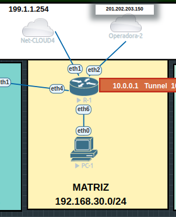

Vamos colocar o caso em que temos de monitorar a internet da nossa operadora 1 com IP 201.202.203.150 caso venha uma eventual queda queremos que o segundo link fique online. Podemos criar uma regra no netwatch para monitorar um Root server, pode ser um servidor DNS que fique sempre online.

- Conseguimos encontrar um por aqui.
    - https://root-servers.org/

Criaremos uma Rota default para tudo que for com destino ao servidor root 	198.97.190.53 irá sair por nossa operadora 1

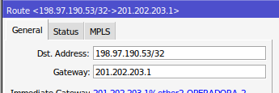

Feito isso precisamos de criar uma regra no firewall, impedindo que em uma eventual queda do link de internet da operadora um a subida do link de internet 2 através da distancia das rotas default o netwatch volte a pingar novamente por outro operadora.

 

Tudo que for da chain output, ou seja originado do meu gateway com destino a 198.97.190.53 ação DROP.

Iremos precisar de comentar nossa rota Default da operadora 1 


Feito tudo isso voltamos a configuração do nosso Netwatch indo na nossa regra criada do Netwatch
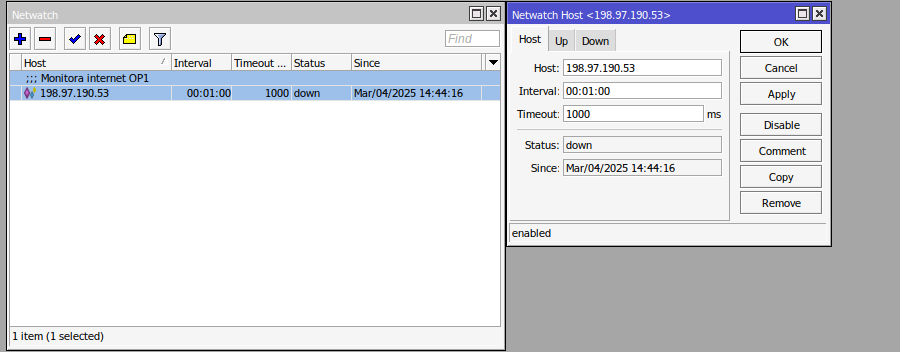
Podemos ver que dentro da nossa regra criada existe duas opções, UP e Down, caso o monitoramento passe para status Down signigica que nosso link da operadora 1 esta down e neste momento iremos precisar de subir nossa outra rota.

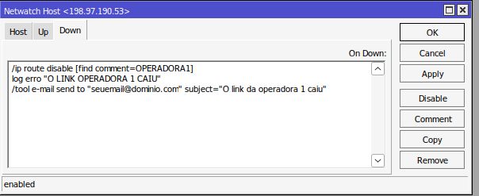

Como pode ver ele executa um script caso venha uma eventual queda deste monitoramento. Veremos melhor oque faz estes comandos.
```bash
/ip route disable [find comment=OPERADORA1]  ## Irá desabilitar a rota que estiver com o comentario "OPERADORA1"
log erro "O LINK OPERADORA 1 CAIU" ## Irá gerar um log no MK caso venha cair
/tool e-mail send to "seuemail@dominio.com" subject="O link da operadora 1 caiu" ### Como configuramos o email acima, podemos utilizalo para fazer envios de email.
```

Da mesma maneira podemos colocar o Script na config para UP caso venha subir o link.

Como pode ver ele executa um script caso venha uma eventual queda deste monitoramento. Veremos melhor oque faz estes comandos.
```bash
/ip route disable [find comment=OPERADORA1]  ## Irá Habilitar a rota que estiver com o comentario "OPERADORA1"
log erro "O LINK OPERADORA 1 VOLTOU" ## Irá gerar um log no MK caso venha voltar
/tool e-mail send to "seuemail@dominio.com" subject="O link da operadora 1 Voltou" ### Como configuramos o email acima, podemos utilizalo para fazer envios de email.
```
isso é apenas um demonstração de como pode ser utilizado esta ferramenta a prol de um administrador de rede, como esta aberta a script podemos controlar melhor um failover ou um failback, alterando configurações de VLAN, DHCP, interfaces oque vier a sua necessidade.

## Ping
Por mais que pareça uma ferramenta simples conseguimos ter algumas funcionalidades avançadas.

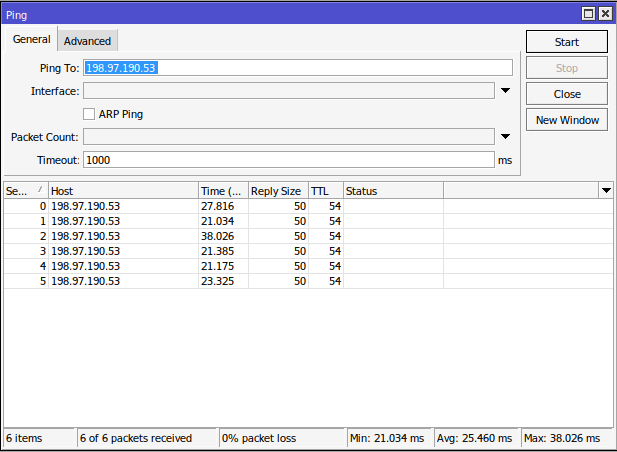

- Ping to: Destino do pacote
- Interface: Consigo selecionar de qual interface estarei saindo 
- Package count: Seleciono a quantidade de PING que irá realizar

Na guia Advanced

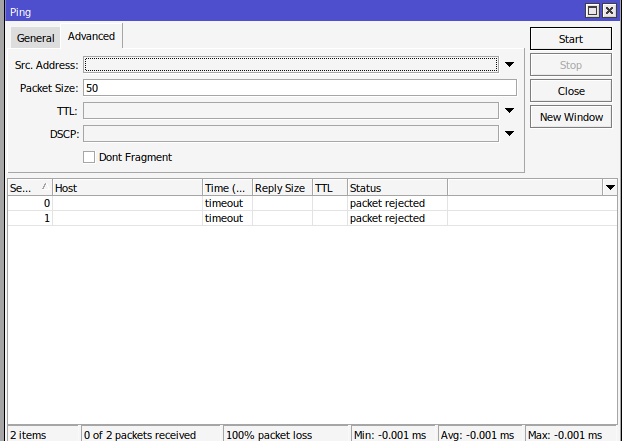

Conseguimos definir:
- Src address: Podemos colocar algum IP de dentro da nossa rede para fazer o ping, ou seja ele irá colocar este IP de origem no cabeçalho da requisição
- Packet Size: Conseguimos definir o tamanho do pacote (MTU)
    - Logo abaixo, tem uma opção de Dont Fragment para não fragmentar o pacote.
- TTL: Define o tempo de vida do pacote, ou seja podemos limitar quantos saltos este pacote pode dar até o destino.


## Traceroute
Como ja conhecemos, traceroute ele mapeia a rota até um destino, dentro do microtik tambem temos essa funcionalidade.
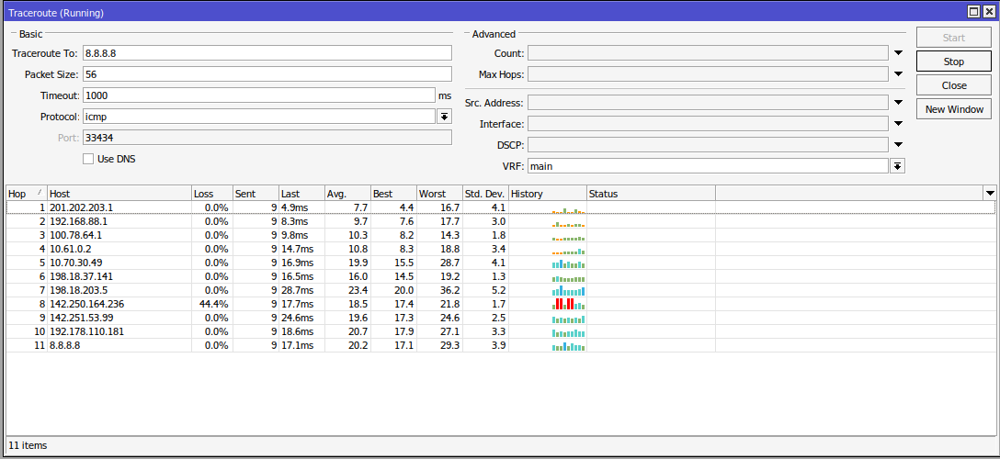

## Profile
Esta funcionalidade nos permite ver o desempenho e utilização do processador do nosso equipamento

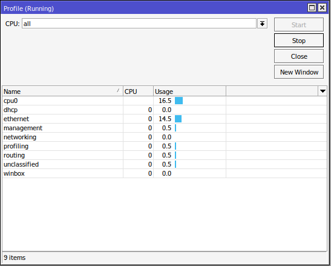

Conseguimos monitorar como esta utilização de todos os nossos processadores.Conseguimos tambem selecionar um nucleo e ver quais serviços estão ocupando este nucleo.

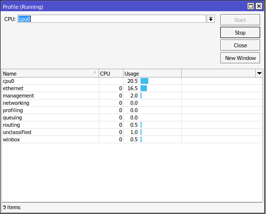


## Torch

Ferremamenta extremamente util para monitoramento de trafego e consumo dentro do Microtik.


Conseguimos monitarar trafego de diversas maneiras através do Torch, temos filtros de por exemplo.

- Interface
- Collect
    - Src.address IPV4 ou IPV6: Ver o trafego originado de determinado IP
    - Dst.address IPV4 ou IPV6: Filtrar por requisições de destinos específicos
    - Port: Filtrar trafico a partir de portas TCP
    - Protocol: Ver trafego de especico protocolo
    - Vlan id: Trafego de determinada Vlan

A partir desta ferramenta podemos ter uma abrangência muito grande de como o trafego esta sendo passado pela rede, seria uma ferramenta similar ao que se tem do wireshark, porem como ferramenta dentro do software routeros. Imagine que queria ver o trafego que esta sendo navegado na sua rede, onde esta tendo maior consumo de internet e como ou para onde esta indo este consumo. Imagine que queira ver quais o quanto de trafego passe para determinado site em sua rede. Ferramenta muito utilizada para diagnoticar uma rede e como os dados estão sendo trafegados. Muitos casos de uso para por exemplo analistas de seguranças e administradores de rede.

## Graph
Ferramenta de graficos do prórpio router os a partir dele conseguimos fazer o monitoramento de interfaces dentro próprio router OS.
Para fazermos a configuração, basta irmos em toos > graph e selecionar os graficos que iremos querer monitorar.


Selecionamos: 
- Interface: Podemos deixar alguma interface fisica ou lógica para monitorar ou até mesmo todas.
- Allow Address: Qual o ip que poderá acessar esta funcionalidade.
- Store On Disk: Irá armanezar as informações no disco.


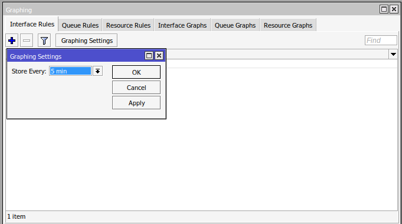
No botão de graph settings, selecionamos de quanto em quanto tempo irá armazenar no storage.

Conseguimos visualizar todas as interfaces que estão sendo exibidos os graficos de duas maneiras, através de dentro do próprio winbox, montando abrindo um fráfico atrás do outro e montando se grid.
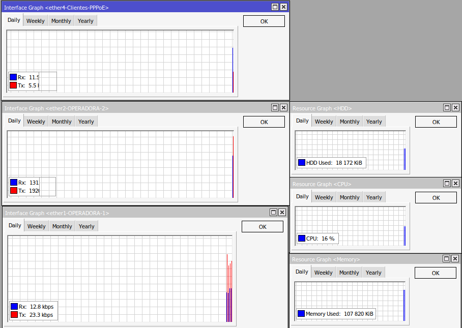

Estamos fazendo monitoramento do trafego de todas as interfaces e tambem sobre o hardware do dispositvo.
Podemos tambem acessar os graficos através do webfig do router O.S acessando através do navegador os gráficos.

CPU Usage
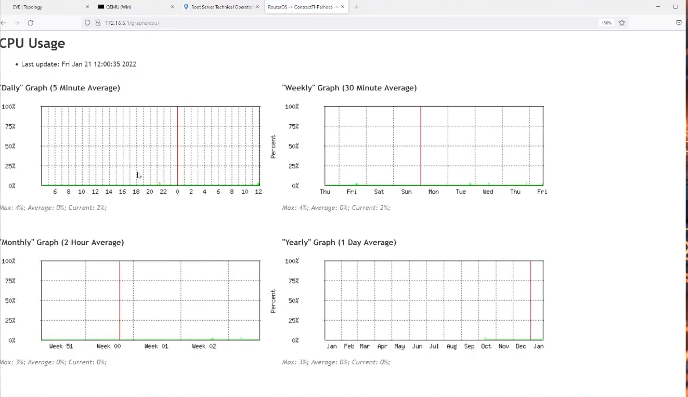
Interface
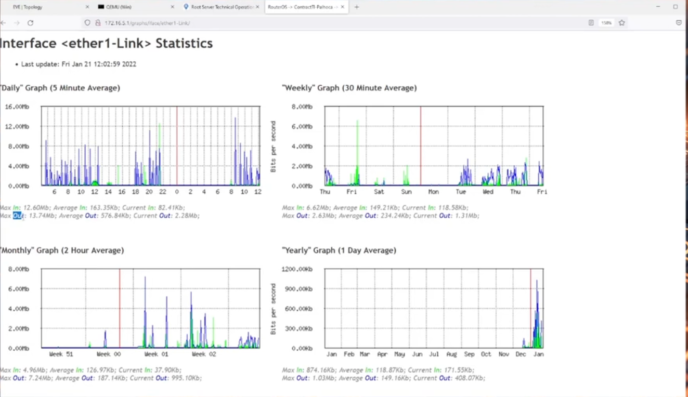


## SNMP
Podemos gerenciar o protocolo SNMP através do winbox através de `IP > SNMP` 
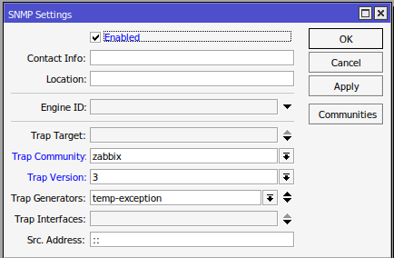
Podemos definir:
- Informações de contato
- Localização
- Trap version: Recomendo a 3
- Trap Comunit: Arquivo de autenticação SNMP

Clicando no Comunities poderemos criar regras de autenticação de acesso.
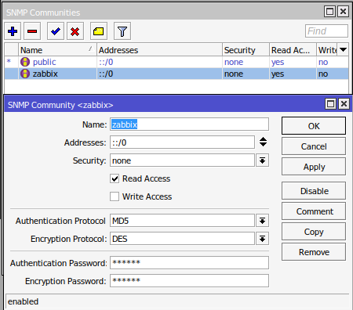
Podemos definir regras de quem é que pode acessar, permissões, protocolo e senha de autenticação.

## Suporte.rif
Caso queira baixar as configurações do equipamento para enviar para algum consultor ou outra pessoa para que tenha acesso as configurações do seu router porem sem ter acesso a ele. Podemos gerar um arquivo no router os que baixe as configurações no formato .rif que pode ser feito o uload no site da microtik. Na prórpria interce inicial do winbox vai um botão com de baixar este arquivo. Logo após é semente fazer o dowload do arquivo em File e depois fazer um upload de visualização deste arquivo no site da mircotik.

- https://mikrotik.com/client/supout

Logo após é só fazer o upload no site e pronto.
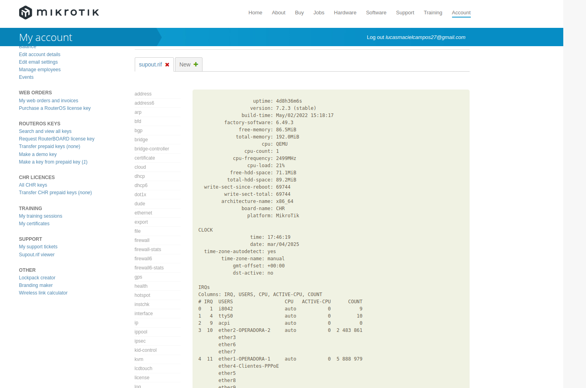